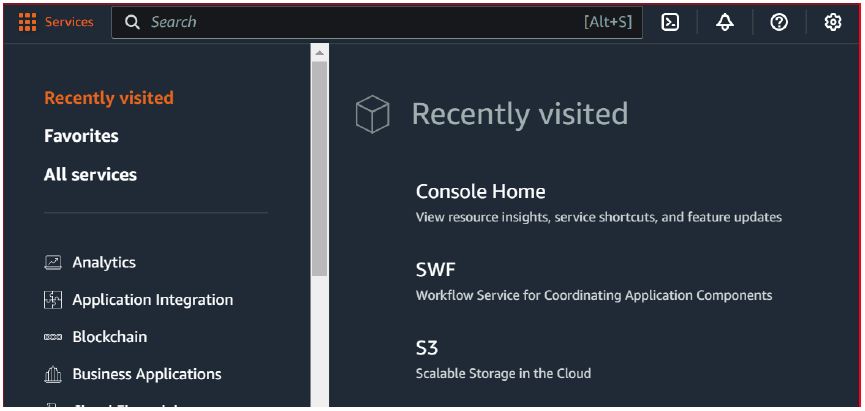
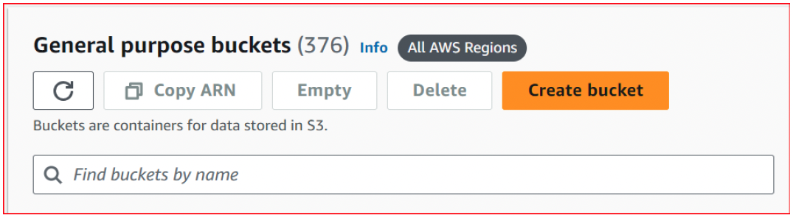
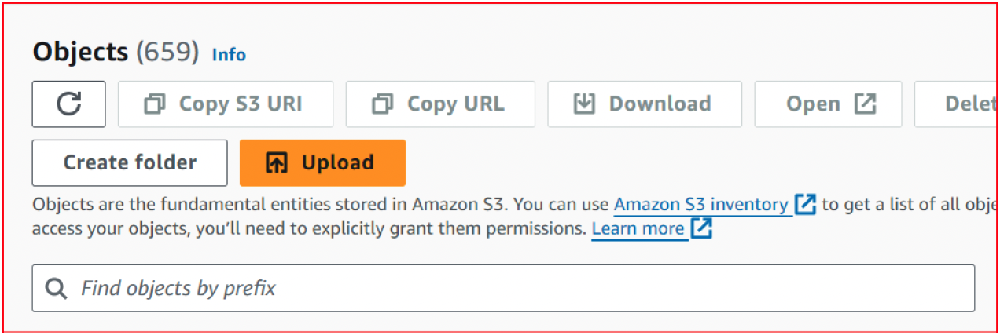
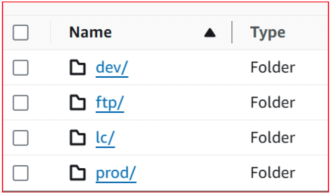
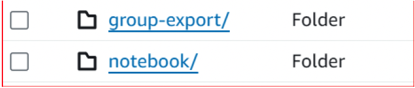
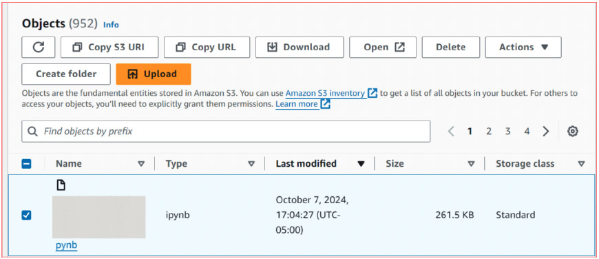
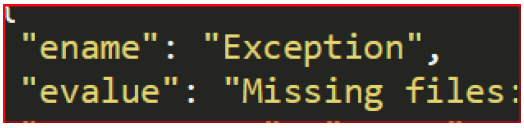
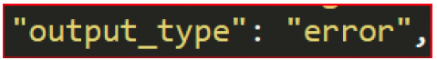

# Troubleshoot using Jupyter Notebooks in AWS

## Description

A quick how-to guide for resolving common file and data issues encountered while using Jupyter Notebooks.

### Before logging in AWS, ensure the following has been identified:
1. The proper datacenter - this is used to search for the appropriate client name.
2. The Jupyter Notebook name - this will be used to find the proper notebook and its corresponding logs.
3. The date and time of the failure or error occurrence - this identifier is important if there are multiple notebooks with the same name.

### Steps to troubleshoot:
1. Log into AWS using the appropriate credentials
2. Using the application selector in the top left-hand corner, choose the S3 application:

3. In the General Purpose Buckets search bar, enter the proper bucket name and click on the name:

4. In the Objects search bar, enter the client name and click on the name:

5. Several options will appear after clicking on the client name, click on the environment:

6. Click on the Notebook link:

7. Using the name of the Jupyter Notebook and the date/time of the failure/error, toggle the last modified column to the most recent date and select the desired notebook name.
8. Select the radio button to the left of the notebook name and click on Download:

9. Save the file to the desired file location.
10. Open the file in a text editor (examples include, but are not limited to Notepad++ and Sublime).
Note: When the file is open, you may see a lot of technical jargon. To identify and troubleshoot errors efficiently, search for any of the following terms:
  + Ename
  + Error
  + Error message

11. When the error has been identified, follow up with the proper resources to finish troubleshooting and resolve the issue (i.e. if the error message indicates that files are missing, reach out to the client informing them that files are needed to resolve the issue).

[Back to Portfolio](../README.md)
